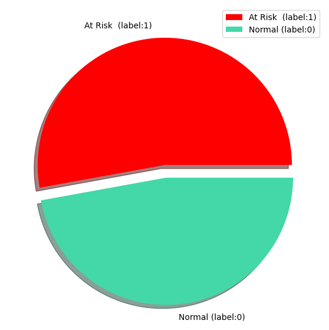

# Heart Disease Prediction Project

## Project Overview

The Heart Disease Prediction Project aims to develop a machine learning model that can accurately predict the presence of heart disease in patients based on various health metrics. This project leverages Support Vector Machines (SVM) with different kernels, to compare them and achieve high accuracy in predictions.

## Table of Contents

- [Introduction](#introduction)
- [Dataset](#dataset)
- [Methodology](#methodology)
- [Algorithms Used](#algorithms-used)
- [Evaluation Metrics](#evaluation-metrics)
- [Results](#results)
- [Conclusion](#conclusion)

## Introduction

Heart disease remains one of the leading causes of death worldwide. Early detection and accurate diagnosis are crucial for effective treatment. This project utilizes machine learning techniques to assist in predicting heart disease based on patient data.

## Dataset

The dataset used in this project includes various health metrics from patients. Key features include:

- Age
- Sex
- Chest Pain Type
- Resting Blood Pressure
- Serum Cholesterol
- Fasting Blood Sugar
- Resting Electrocardiographic Results
- Maximum Heart Rate Achieved
- Exercise Induced Angina
- Oldpeak
- Slope of Peak Exercise ST Segment
- Number of Major Vessels
- Thalassemia
- Target Variable (Presence of Heart Disease)

To enhance our understanding of the dataset, we will explore several visualizations that illustrate key characteristics and relationships within the data.

  
  

## Methodology

1. **Data Preprocessing**: Cleaning the data, handling missing values, performing feature scaling, and detecting outliers using statistical methods like the Z-test.
   
   
   
2. **Exploratory Data Analysis (EDA)**: Analyzing the dataset to find patterns and relationships among variables.
3. **Model Training**: Splitting the data into training and testing sets and training the models.
4. **Model Evaluation**: Assessing the performance of each model using appropriate metrics.

## Algorithms Used

- **Support Vector Machines (SVM)**: Employed with various kernels (linear, RBF, polynomial) to classify the data.

## Evaluation Metrics

To evaluate the performance of the models, the following metrics were used:

- Accuracy
- Precision
- Recall
- F1 Score
- Confusion Matrix

## Results

### Linear

### Polynomial

### RBF

## Conclusion

The Heart Disease Prediction Project successfully demonstrated the application of machine learning techniques in predicting heart disease. The findings can assist healthcare professionals in making informed decisions based on predictive analytics.

